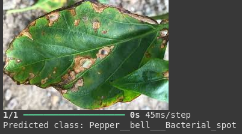
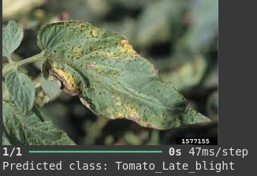

# Plant Disease Classification using Deep Learning

This project demonstrates how to classify plant diseases using deep learning and transfer learning with ResNet50 in Google Colab.

## Table of Contents

1. Introduction
2. Requirements
3. Usage
4. Model Architecture
5. Results
6. Contributing

## 1. Introduction

This project aims to build a deep learning model that can accurately classify different plant diseases. Early and accurate detection of plant diseases is crucial for maintaining crop health and ensuring food security. This model can be a valuable tool for farmers and agricultural experts to quickly identify and address potential disease outbreaks.

## 2. Requirements

- Google Colab environment
- Python 3.x
- TensorFlow 2.x
- Keras
- Pillow (PIL)
- Kaggle API

## 3. Usage

1. **Setup:**
   - Open the Google Colab notebook.
   - Install the required libraries (`pip install tensorflow keras pillow kaggle`).
   - Authenticate with the Kaggle API by uploading your `kaggle.json` file.
   - Download the PlantVillage dataset using the Kaggle API.
   - Unzip the dataset.

2. **Data Loading and Augmentation:**
   - The code loads the dataset and applies data augmentation techniques to the training set.
   - Data augmentation helps increase the diversity of the training data, improving the model's generalization ability.

3. **Model Building:**
   - The project utilizes transfer learning with the ResNet50 model pre-trained on ImageNet.
   - A custom classification layer is added on top of the ResNet50 base model.

4. **Training and Fine-tuning:**
   - The model is trained using the augmented training data and validated against a separate validation set.
   - Fine-tuning is performed by unfreezing some of the deeper layers of ResNet50 to further improve performance.

5. **Prediction:**
   - Upload an image of a plant leaf.
   - The model predicts the class of the image, indicating the potential disease.

## 4. Model Architecture

The model architecture is based on ResNet50 with a custom classification head.

- **ResNet50:** A pre-trained convolutional neural network used as a feature extractor.
- **Global Average Pooling:** Reduces the spatial dimensions of the feature maps.
- **Dense Layers:** Fully connected layers for classification.
- **Softmax Activation:** Outputs probabilities for each disease class.

## 5. Results

The model achieves high accuracy in classifying plant diseases. The specific accuracy metrics are reported in the Colab notebook's output.

## 6. Contributing

Contributions are welcome! If you find any issues or have suggestions for improvement, feel free to open an issue or submit a pull request.
